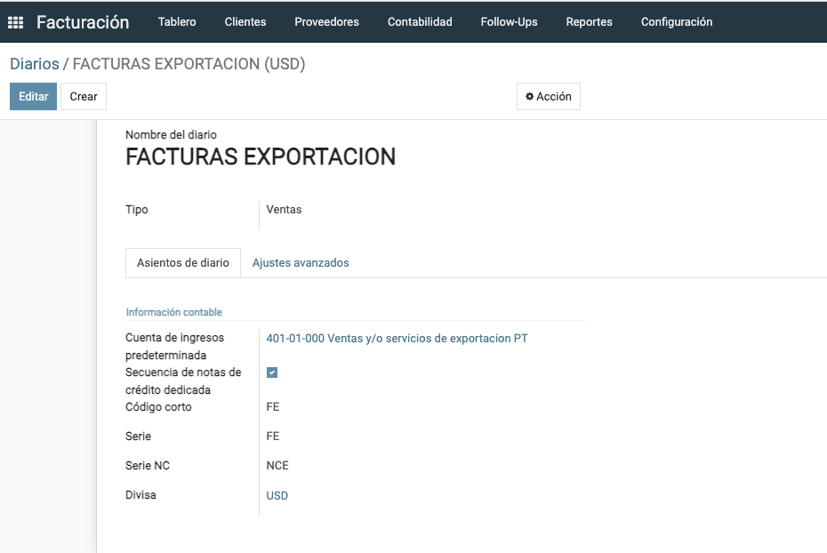

Facturacion Electrónica
=======================

.. _installation:

Configurando mi Facturacion
---------------------------

.. toctree::
   V15
   V12
   V10

**Series**

Las series se configuran en el módulo de contabilidad, en el menú :menuselection:`Contabilidad --> Series`. 

.. image:: images/series.png

Es el número de serie que utiliza el contribuyente para control
interno de su información. Este campo acepta de 1 hasta 25
caracteres alfanuméricos.

.. note::

   Normalmente se utilizan de acuerdo a la usanza palabras de 3 letras para 
   diferenciar las sucursales de la matriz, al dia de hoy, formalmente se usa
   LugardeExpedicion, donde se debe registrar el código postal del lugar de expedición del
   comprobante (domicilio de la matriz o de la sucursal)

Timbrado Factura
----------------

En México, el Comprobante Fiscal Digital por Internet (CFDI) es un documento electrónico que se utiliza para llevar un registro de las transacciones comerciales y fiscales entre contribuyentes. 
El CFDI ha evolucionado a lo largo del tiempo, y en su versión más reciente, la 4.0, se han introducido cambios significativos. ::

Comprobante de Pago (REP)
-------------------------

Nota de Crédito
---------------

Dentro de la emisión de CFDI 4.0, uno de los tipos de comprobantes más comunes es el CFDI de **Egreso** en la clasificacion es el tipo E. ::

El Comprobante de Egreso es un tipo de CFDI empleado para avalar devoluciones, descuentos y bonificaciones para efectos de deducibilidad. ::

